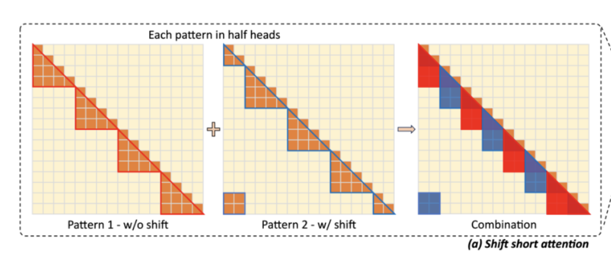
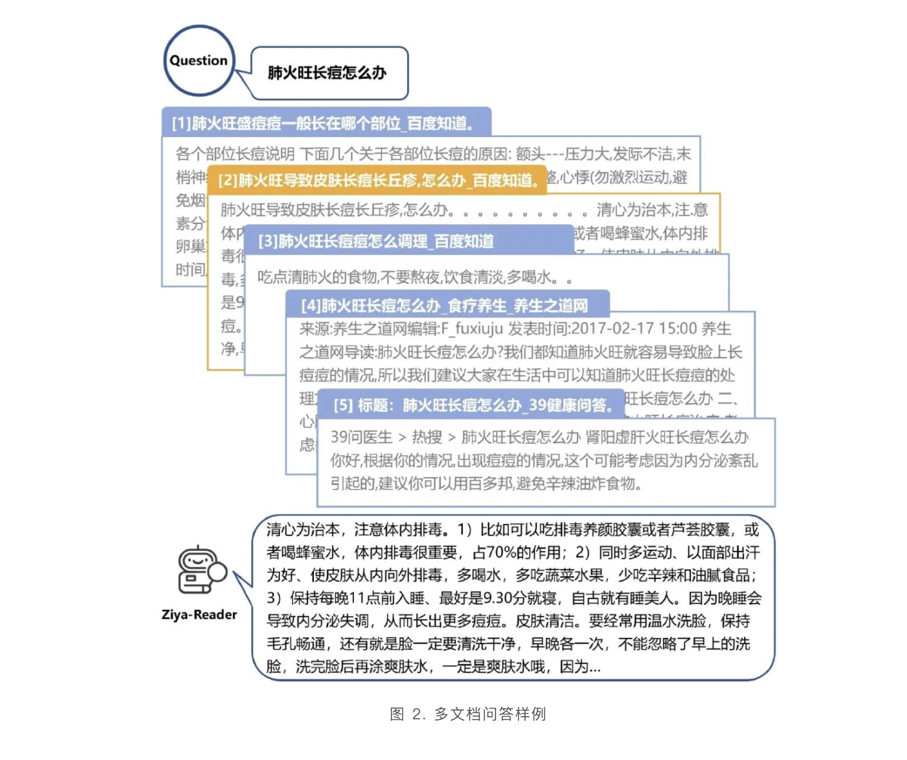
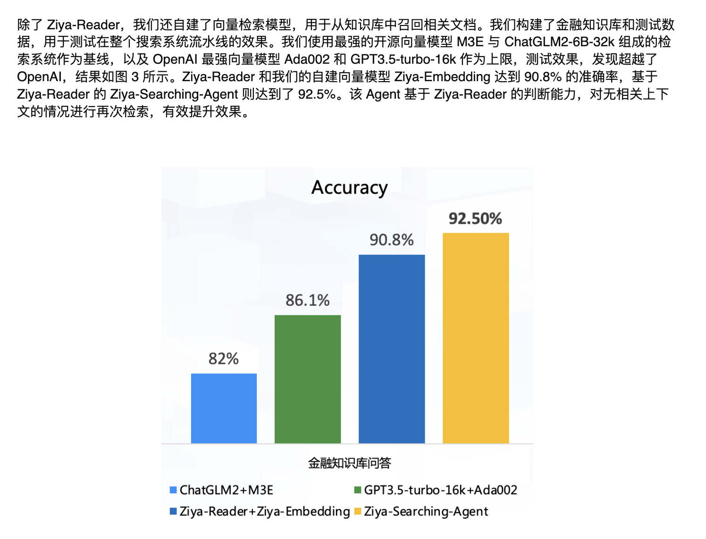

10.23-10.29

# 超长文本对话

## 基于longlora的预训练模型：[Yukang/Llama-2-13b-longlora-32k-ft · Hugging Face](https://huggingface.co/Yukang/Llama-2-13b-longlora-32k-ft)

通过Shift-window做到的

预训练数据：[Yukang/LongAlpaca-12k · Datasets at Hugging Face](https://huggingface.co/datasets/Yukang/LongAlpaca-12k)

## ziya-reader-13B

[社区供稿 | 为知识检索而生，Ziya-Reader 开源，多个长文本中文任务第一 - 智源社区](https://hub.baai.ac.cn/view/31687)

[[2210.08590] Zero-Shot Learners for Natural Language Understanding via a Unified Multiple Choice Perspective](https://arxiv.org/abs/2210.08590)

8k上下文，在特定数据集上训练过，但是主要提升的是准确度，针对“长文本"没很多的改进，但是其中的searching-agent倒是在相关文档召回上有提升

streamingLLM情况：streamingLLM可以实现不用清空KV-cache的对话，持续流畅的进行问答，但是其窗口限制还是基于原本基座模型的窗口大小，对于超长文本无太大提升。

moonshot-ai：超长文本模型，商业模型，效果一般。
