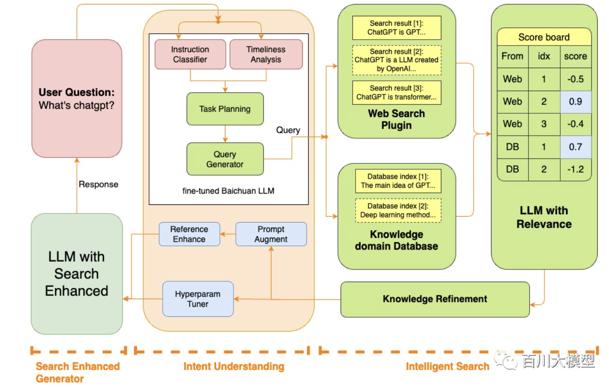

## 第一阶段：CP(Continue PreTraining) 增量训练

1. 在海量领域数据上二次预训练基座模型，以注入领域知识（可选），在之前这一步是和SFT一起做的，后续和单独分开来。
2. 主要难点在于：
   1. 如何处理自己的数据，海量数据如何平衡于配比
   2. 训练模型的哪些层，冻结哪些参数，是否要逐层解冻，模型大小是否要蒸馏等。
   3. 训练参数，损失函数等超参优化
   4. 模型评估
3. ~~是否要重定义词袋~~：bc-26K qw-3w
   1. 若要重定义词袋则需要较大代价
   2. 可查看Qwen的词袋构建方法，如何压缩，用的什么模型。

## 第二阶段：SFT (Supervised Fine-tuning) 有监督微调

1. 构造指令微调数据集，在预训练模型基础上做指令精调，以对齐指令意图
2. 主要难点在于：
   1. 构造的指令数据集的形式
   2. lora和qlora等高效微调技术
   3. 模型评估

## 第三阶段：模型的优化方法

- RLHF (Reinforcement Learning from Human Feedback) 基于人类反馈对语言模型进行强化学习，分为两步：

  - RM (Reward Model) 奖励模型建模，构造人类偏好排序数据集，训练奖励模型，用来建模人类偏好，主要是 "HHH" 原则，具体是 "helpful, honest, harmless"
  - RL (Reinforcement Learning) 强化学习，用奖励模型来训练 SFT 模型，生成模型使用奖励或惩罚来更新其策略，以便生成更高质量、更符合人类偏好的文本
- [DPO(Direct Preference Optimization)](https://arxiv.org/pdf/2305.18290.pdf) 直接偏好优化方法，DPO 通过直接优化语言模型来实现对其行为的精确控制，而无需使用复杂的强化学习，也可以有效学习到人类偏好，DPO 相较于 RLHF 更容易实现且易于训练，效果更好

## 第四阶段：模型高级

1. 该阶段的主要典型如：agent、cot等都是基于构造特定的数据（Qwen对agent优化过，效果据说有提升）、或者在模型外部做一定的改进训练出来的结果，主要难点在于流程比较繁琐，尤其是数据构造方面。(agent本质上是基于system prompt的，但标准变化太快，做的话建议基于Langchain的ReAct模式来做，标准不变)
2. 模型的蒸馏，量化，剪枝、加速等内容涉及到部分模型基础架构，这里先按下不表。

## 第五阶段：模型外部处理

1. 模型外部的后处理对于效果的提升很大
2. 意图识别很重要，可以构造一个根据输入来切换prompt的模板
3. 重视chain的作用，chain是控制模型稳定输出的核心

## lora原理相关

lora：[[2106.09685] LoRA: Low-Rank Adaptation of Large Language Models (arxiv.org)](https://arxiv.org/abs/2106.09685)

q-lora：[[2305.14314] QLoRA: Efficient Finetuning of Quantized LLMs (arxiv.org)](https://arxiv.org/abs/2305.14314)

[ymcui/Chinese-LLaMA-Alpaca: 中文 LLaMA&amp;Alpaca 大语言模型 + 本地 CPU/GPU 训练部署 (Chinese LLaMA &amp; Alpaca LLMs) (github.com)](https://github.com/ymcui/Chinese-LLaMA-Alpaca)

[LianjiaTech/BELLE: BELLE: Be Everyone&#39;s Large Language model Engine（开源中文对话大模型） (github.com)](https://github.com/LianjiaTech/BELLE)

cot和q-lora
[PhoebusSi/Alpaca-CoT: We unified the interfaces of instruction-tuning data (e.g., CoT data), multiple LLMs and parameter-efficient methods (e.g., lora, p-tuning) together for easy use. Meanwhile, we created a new branch to build a Tabular LLM.（我们分别统一了丰富的IFT数据（如CoT数据，目前仍不断扩充）、多种训练效率方法（如lora，p-tuning）以及多种LLMs，三个层面上的接口，打造方便研究人员上手的LLM-IFT研究平台。同时tabular_llm分支构建了面向表格智能任务的LLM。 (github.com)](https://github.com/PhoebusSi/Alpaca-CoT)

chatglm高效微调框架：[hiyouga/ChatGLM-Efficient-Tuning: Fine-tuning ChatGLM-6B with PEFT | 基于 PEFT 的高效 ChatGLM 微调 (github.com)](https://github.com/hiyouga/ChatGLM-Efficient-Tuning)

## finetune代码相关

qlora: [iamarunbrahma/finetuned-qlora-falcon7b-medical: Finetuning of Falcon-7B LLM using QLoRA on Mental Health Conversational Dataset](https://github.com/iamarunbrahma/finetuned-qlora-falcon7b-medical)

lora: [ymcui/Chinese-LLaMA-Alpaca: 中文 LLaMA&amp;Alpaca 大语言模型 + 本地 CPU/GPU 训练部署 (Chinese LLaMA &amp; Alpaca LLMs)](https://github.com/ymcui/Chinese-LLaMA-Alpaca)

[ymcui/Chinese-LLaMA-Alpaca-2: 中文LLaMA-2 &amp; Alpaca-2大模型二期项目 + 16K超长上下文模型 (Chinese LLaMA-2 &amp; Alpaca-2 LLMs, including 16K long context models)](https://github.com/ymcui/Chinese-LLaMA-Alpaca-2)

prefix-tuning:[XiangLi1999/PrefixTuning: Prefix-Tuning: Optimizing Continuous Prompts for Generation](https://github.com/XiangLi1999/PrefixTuning)

p-tuning:[THUDM/P-tuning-v2: An optimized deep prompt tuning strategy comparable to fine-tuning across scales and tasks](https://github.com/THUDM/P-tuning-v2)

## 其他

baichuan-13bv2放出的全训练过程
Qwen-14b放出的全训练过程
qwen-140b，4bit，4卡

幻觉优化：
[百川智能发布 Baichuan2-53B，开放 API 全面进军 To B 领域](https://mp.weixin.qq.com/s/7gFCnPgox0lJ6ISBJKDj3Q)

