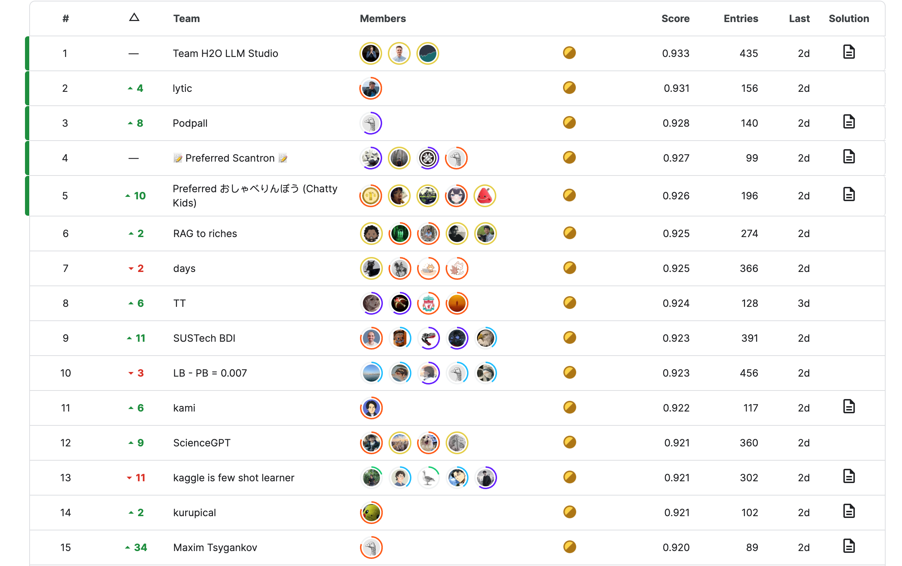

## 知识图谱增强LLM相关

复旦大学医学图谱增强模型：
[[FudanDISC/DISC-MedLLM: Repository of DISC-MedLLM, it is a comprehensive solution that leverages Large Language Models (LLMs) to provide accurate and truthful medical response in end-to-end conversational healthcare services. (github.com)](https://github.com/FudanDISC/DISC-MedLLM)

nebulaGraph实现图谱增强LLM
[feat: KG RAG query engine, enable Graph RAG on existing KGs by wey-gu · Pull Request #7204 · jerryjliu/llama_index (github.com)](https://github.com/jerryjliu/llama_index/pull/7204)

[NebulaGraphQAChain | 🦜️🔗 Langchain](https://python.langchain.com/docs/use_cases/more/graph/graph_nebula_qa)

https://twitter.com/LangChainAI/status/1698009136263299582?s=20

[llama_index/llama_index/query_engine/knowledge_graph_query_engine.py at 71919f9dfa09e9628af8b3a59d497ad02a7a82f8 · jerryjliu/llama_index (github.com)](https://github.com/jerryjliu/llama_index/blob/71919f9dfa09e9628af8b3a59d497ad02a7a82f8/llama_index/query_engine/knowledge_graph_query_engine.py#L24)

text2sql相关：
[cubenlp/ChatSQL: 自然语言转 SQL，直接连接数据库查询 (github.com)](https://github.com/cubenlp/ChatSQL)

## 数据构造改进空间：

1. 角度太单一，应按段落让gpt4从多个角度和多个层面去，总结，去提问，去识别，归类，生成。
2. 尝试考虑使用多轮对话调优
3. *cot也可以尝试使用，提高模型能力，但是减慢速度
   1. 寻找cot的模板和数据集
   2. 微调一版模型（需要大参数量才可以）
   3. 对齐问题

## 高阶模型用法

[Tree of Thoughts: 让语言模型学习人类思考的方式去解决问题](https://mp.weixin.qq.com/s?__biz=Mzk0NzMwNjU5Nw%3D%3D&mid=2247484829&idx=1&sn=505772ed5d94a4a07e6f6c844a7cc3f2&chksm=c379ac97f40e25819dc54d4bdd50575e95bec2355d50f6f269693df8f7ac644f0c431b4a9ba3&scene=126&sessionid=1694919554#rd)

[ToolLLM=LLM+tool use-- 大模型的高级玩法](https://mp.weixin.qq.com/s?__biz=Mzk0NzMwNjU5Nw%3D%3D&mid=2247484893&idx=1&sn=142521e30011d02ce7c32a06226e598e&chksm=c379acd7f40e25c1c2dade4a82ae2a689184473309b05e6eec6506e68a65f7686251c8b19d93&scene=126&sessionid=1694919554#rd)

## 关于大模型文档检索的比赛

[Kaggle - LLM Science Exam | Kaggle](https://www.kaggle.com/competitions/kaggle-llm-science-exam/leaderboard)

这个方案里的大模型应用都很出出众

其中关于 RAG 和微调的选择解释的很清楚: **在外部知识要求高的情况下，优先 RAG，需要模型适配（风格行为词汇）等，就需要微调，两者要求都高的话，需要结合使用。**

[Kaggle - LLM Science Exam | Kaggle](https://www.kaggle.com/competitions/kaggle-llm-science-exam/discussion/446422) 这是第一名的方案

第一名很早之前就使用了 RAG + 微调，一直遥遥领先，其具体的关键点为：

> 1. RAG + 维基百科文档
> 2. e5 向量模型做embedding
> 3. 自己定制 pytorch 的相似度模型，无需 faiss，可以解决 GPU 显存不够的问题。
> 4. 大多数模型是 7B 和融合。
> 5. 想让 deberta work，但是大模型太强了，甚至融合都没用。
> 6. 所有的 LLM 都是二分类头 + 微调的。
> 7. 用了两种典型的分类头结构

[Kaggle - LLM Science Exam | Kaggle](https://www.kaggle.com/competitions/kaggle-llm-science-exam/discussion/446307) 这是第四名方案

第四名的方案的亮点是召回。其三路召回为：

v3：根据 Elasticsearch 搜索时的分数对上下文进行排序。
v5：根据与问句的编辑距离对上下文进行排序。
v7：使用语义搜索对上下文进行排序，使用句子转换器实现。
对于提示和维基百科之间的嵌入，使用了 msmarco-bert-base-dot-v5。对于选项和维基百科之间的嵌入，使用了 all-mpnet-base-v2。

这两个想法都很不错

其实金牌选手的想法都可以借鉴一下：

