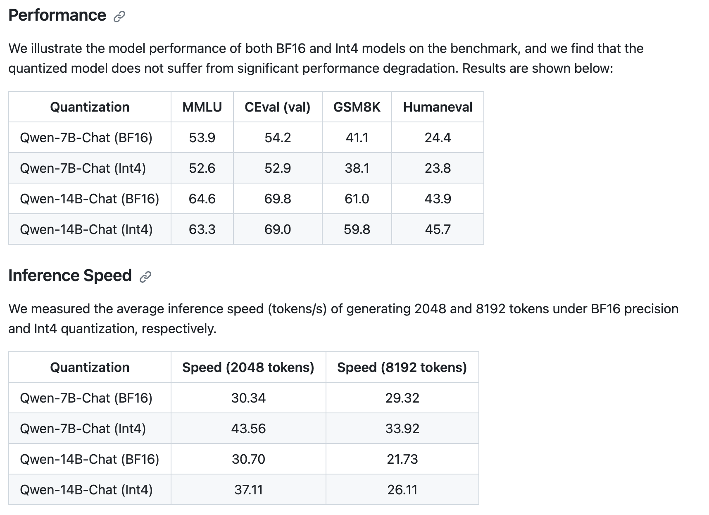

## 量化相关：

[使用 AutoGPTQ 和 transformers 让大语言模型更轻量化](https://mp.weixin.qq.com/s/BH5Ii-jHxRkBPrf408ezhw)

量化是为了压缩模型大小，降低计算复杂度。它的基本思想是将模型中的权重从浮点数表示转换为低位宽的整数表示，比如从 fp32 位浮点数，fp16、bp16变为 fp8 位整数。

常见的量化方法有:

1. 训练阶段量化 (Quantization Aware Training, QAT): 在训练的时候就采用量化操作，通过将参数进行==SVD分解，或者PCA主成分分析==来减少参数量，使模型适应量化，这样的到的结果直接就是是一个量化模型。
2. 训练后量化模型 (Post Training Quantization, PTQ): 先训练出一个全精度的模型，然后再进行量化，例如GPTQ等。
3. 推理时动态量化 (Dynamic Quantization, DQ): 在推理时动态地对每层的推理结果进行量化，该量化好处是开箱即用，坏处是速度和精度可能都会收到较大影响

## 重要

目前业内最流行的的是：exllama，vllm，fastllm等pipeline，快速量化模型，且基本不损失精度，或者已经集成到transformer库里的Auto-GPTQ量化

量化通常分为权重量化和激活量化。权重量化比较容易，可以对权重进行线性量化，比如将 0-1 之间的权重线性映射到 0-255 之间的整数。
激活量化更难，需要根据激活值的分布采用非线性量化方式。

Qwen-14B的最新4bit量化几乎无损伤，可以研究

## 量化相关的代码以及项目

[ztxz16/fastllm: 纯 c++ 的全平台 llm 加速库，支持 python 调用，chatglm-6B 级模型单卡可达 10000+token /s，支持 glm, llama, moss 基座，手机端流畅运行](https://github.com/ztxz16/fastllm)

[turboderp/exllama: A more memory-efficient rewrite of the HF transformers implementation of Llama for use with quantized weights.](https://github.com/turboderp/exllama)

[ggerganov/llama.cpp: Port of Facebook&#39;s LLaMA model in C/C++](https://github.com/ggerganov/llama.cpp)
